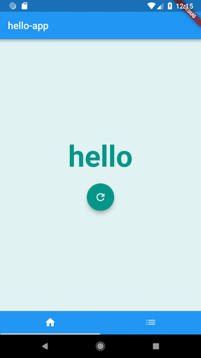
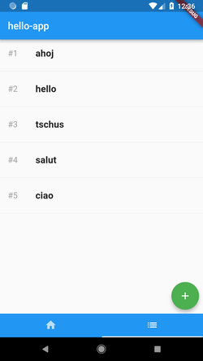

# HELLO_FLUTTER

Private simple playground application with [Flutter](https://flutter.io/).

&nbsp;

## Getting Started

1. [install](https://flutter.io/get-started/install/)
1. check it `$ flutter doctor`
1. run emulator `$ flutter emulators --launch [name]`
1. run application `$ flutter run`

